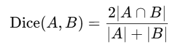
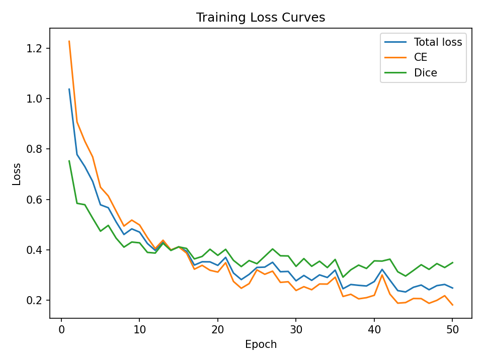
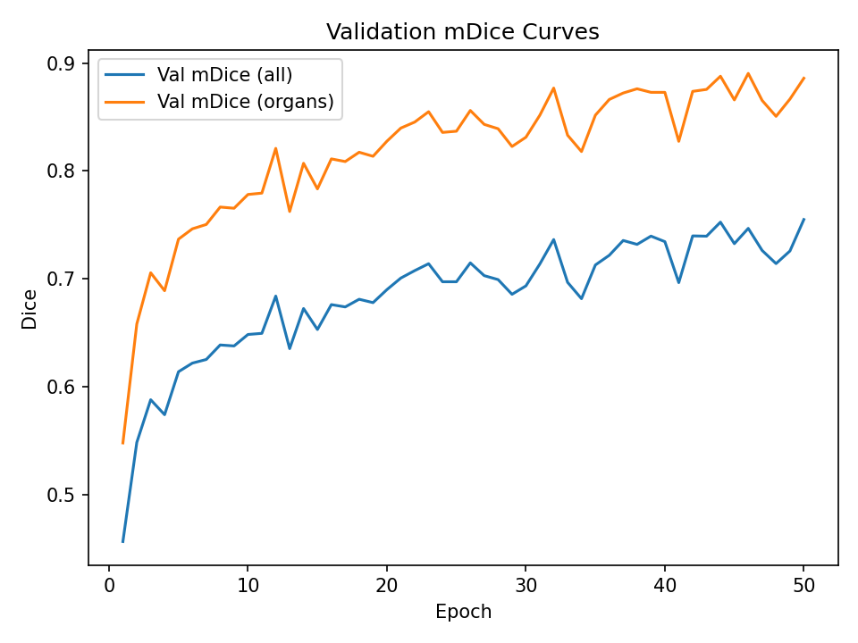
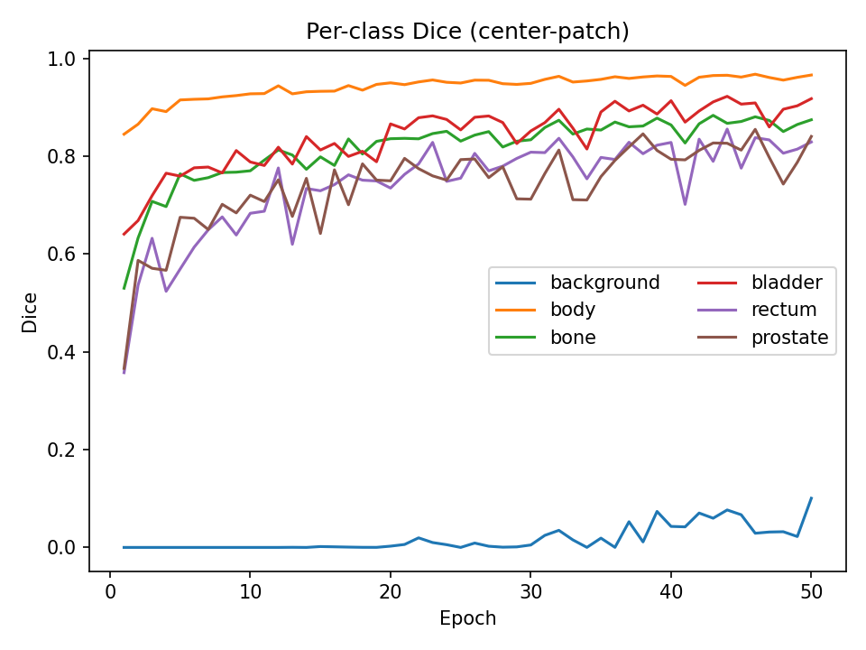
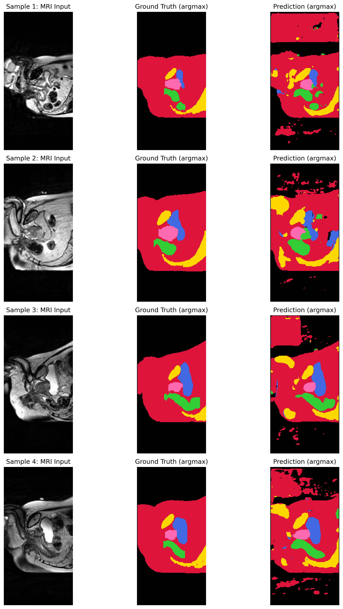
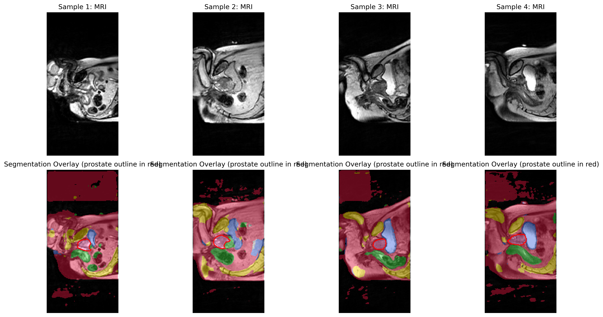

# Prostate 3D Segmentation (Normal)

## Overview
Segment (downsampled) Prostate 3D dataset with a 3D UNet baseline (Normal).we align our reporting with this threshold and present per-class Dice (with and without background), and dataset-level means.

Aiming for per-class Dice ≥ 0.70 on test set; And prostate label Dice ≥ 0.75 on the test set


* Dice similarity coefficient
Measuring the degree of overlap between predictions and true values;The closer to 1, the more overlap.

    
     
## File structures
- `modules.py`  – model components (3D UNet baseline)
- `dataset.py`  – NIfTI I/O, read and preprocessing data
- `train.py`    – training/validation loop; logs loss & per-class Dice; saves curves
- `predict.py`  – sliding-window inference; saves NIfTI + slice PNGs
- `tools_count_labels.py` – count the number of each class
- `quick_check.py` – read a NIfTI，check data and lables
- `README.md`   – this document
- `pics` picture resources for readme file and output from other files

## Environment
- Python 3.10, PyTorch (CUDA 11.8), torch: 2.2.2; nibabel, numpy, scikit-image, torchio, matplotlib.
### Reproducible Environment
We pin versions tested on our runs:
- Python 3.10
- PyTorch 2.2.2 + CUDA 11.8
- numpy 1.26.x, nibabel 5.2.x, scikit-image 0.22.x, torchio 0.19.x, matplotlib 3.8.x

**Create & activate (example, conda):**
```bash
conda create -n prostate3d python=3.10 -y
conda activate prostate3d
pip install torch==2.2.2+cu118 torchvision==0.17.2+cu118 --index-url https://download.pytorch.org/whl/cu118
pip install numpy==1.26.4 nibabel==5.2.1 scikit-image==0.22.0 torchio==0.19.6 matplotlib==3.8.4
```
## Device:
* local:
  * NVIDIA-SMI 527.41 
  * Driver Version: 527.41 
  * CUDA Version: 12.0 2G
* Google lab
  * GPU A100

note: use small patch for run in local with low storage. you can use larger patch by supported GPU
## data
`semantic_MRs_anon/` -  3D MRI volumetric images, `X`

`semantic_labels_anon/` - 3D semantic tags, `Y`

* **canonical id**
    
    e.g:Case_013_Week3_LFOV
* **Image shape**(C,Z,Y,X):
  * C=1（Single-channel）, channel-first 
  * voxel dimension(Z=256, Y=256, X=128)
* **Label uniques**: 
  * 0：background (60.35%)
  * 1: body （35.47%）
  * 2: bone（3.37%）
  * 3: bladder（0.57%）
  * 4: rectum （0.14%）
  * 5: prostate（0.10%）
* num_classes=6
### Split Justification & Class Imbalance
- We choose an **80/10/10** split to balance training volume and unbiased evaluation; the fixed `splits.json` guarantees repeatability across machines.
- The dataset is highly imbalanced (e.g., prostate ~0.10% voxels). We therefore:
  1) compute **class weights** for CE from label histograms at load time,
  2) **exclude background** in the organ-mean (mDice_org) used for model selection,
  3) adopt **balanced random cropping** during training to avoid empty-organ patches.

## result:
Results by test instruction 2(run around 2 hours):
| Channel | Class | Dice Coefficient |
|---------|-------|------------------|
| 0 | Background | 0.9522 |
| 1 | body | 0.9882 |
| 2 | bone | 0.8552 |
| 3 | bladder | 0.8654 |
| 4 | rectum | 0.7832 |
| 5 | prostate | 0.8795 |

**Mean Dice Coefficient**: 0.7496

## Testing Instructions
**train:**
* 1. on local
```powershell
python recognition\prostate3d_Luyi_Ying_48360591\train.py `
  --data_root "D:\document\UQ\4COMP3710\A3\data" `
  --epochs 3 --batch_size 1 `
  --base 8 `
  --patch 64 64 64 `
  --accum 1 `
  --lr 1e-3 `
  --fullval_every 1 `
  --val_patch 64 64 64 --val_overlap 32 `
  --amp
```

* 2. on google lab

```
python {train_script} \\
  --data_root "{data_root_colab}" \\
  --epochs 60 --batch_size 1 \\
  --base 16 \\
  --patch 80 80 80 \\
  --accum 1 \\
  --lr 1e-3 \\
  --fullval_every 1 \\
  --val_patch 80 80 80 --val_overlap 32 \\
  --amp
```
**predict:**
```powershell
python recognition\prostate3d_Luyi_Ying_48360591\predict.py `
  --data_root "D:\document\UQ\4COMP3710\A3\data" `
  --split val `
  --ckpt runs\best.ckpt --outdir runs\preds_val --device cuda `
  --patch 64 64 64 --overlap 16 --amp --num_samples 4 --axis z --slice center
```
## Prediction examples
* Figure 1:training losses

* Figure 2:curves of validation mean dice 

* Figure 3:per class dice(centeral patch)

* Figure 4: Side-by-side comparison of MRI input, ground truth segmentation, and model predictions on test samples

* Figure 5: Segmentation overlays blended with original MRI images for visual interpretation

Visual results demonstrate:
* Precisely outline the prostate contour
* Robust segmentation for different anatomical variations
* The boundaries between adjacent structures need to be improved.
## Implementation Details:
### `dataset.py`
Find the correct file, match the image with the label, normalize the ID, split the data, read the NIfTI, perform normalization, and return the standard tensor.


**input**: --data_root

**return**:  {"id", "image", "label", "affine"}

* import
  * `nibabel`：Reading and writing NIfTI (.nii/.nii.gz) medical 3D volume data
  * `torch.utils.data.Dataset`: Custom PyTorch Dataset Base Class
* `load_nii(path)`
  * Open NIfTI, and use get_fdata() to read it as a three-dimensional array (Z, Y, X) of float32.
  * Returns (data, affine) - (3D , voxel→world)
* `class Prostate3DDataset(Dataset)`
  * Automatic directory adaptation
  * Scan two directories and canonicalize the filenames.
    * `self.img_index = {canonical_id: Path}`
    * `self.lab_index = {canonical_id: Path}`
  * `splits.json`: With a fixed random seed of 42, common_ids 80/10/10 are divided into train/val/test to ensure experimental reproducibility.
### `modules.py`
A minimal runnable 3D U-Net（encoder*3 –bottleneck–decoder *4 + skip connections. Use InstanceNorm3d + LeakyReLU
* **Output** the logits for num_classes channels.
* The parameter `base` can be adjusted to adapt to the video memory.
### `train.py`
training+validation
* Construct a DataLoader using Prostate3DDataset(split=train/val)
* use
  * CrossEntropyLoss baseline; 
  * AdamW optimization; 
  * can enable --amp mixed precision.
* Calculate per-class Dice for each epoch, print the table, and save best.ckpt - mean Dice(val) at `runs/best.ckpt`

**imporved 1**:

In each epoch, only one random patch is taken from each sample. In the next epoch, another patch is taken from a different location within the same volume (randomness + data augmentation). Each epoch uses a center-patch quick check, and after N epochs, a full-scale sliding window verification is performed, saving best.ckpt with the "full-scale metric" as the standard.

  * Do light weight training
  * Replace the loss with CE + Dice (weight 0.5 is relatively stable).

**imporved 2**:
  * change random sampling to balanced sampling to avoid sampling bias
  * set mdice_full_org(get rid of background) as the best indicator

**improved 3**
  * Add category weights to CE
  * Dice is excluded from the background, and small organs are given greater weight.
  * Corrected "Union sampling" → "Class-based equalization sampling" :random_crop_3d_balanced
  
**improved 4**
* Sliding window inference weighted fusion (resolving gaps/joining false negatives)
* Automatically calculate category weights
* Lightweight enhancement: Three-axis random flip + slight intensity perturbation (brightness/contrast + micro-noise), then clamp to [-5,5] to increase robustness without disrupting the medical grayscale distribution.
* loss function: loss = 0.7*CE + 0.3*Dice


**visualize**:
* training_losses.png
  * Total loss = 0.7*CE + 0.3*DiceLoss
* val_mdice.png
  * Val mDice (all) ： Average Dice with background (6 categories)
  * Val mDice (organs) ：The background was removed and only the average of the 5 organs was taken (which is more representative of organ performance).
* val_per_class_dice.png : The six lines represent the Dice of background/body/bone/bladder/rectum/prostate.

**Model selection**: we select `best.ckpt` by **full-volume** organ-mean Dice (excluding background).

**Curves**: training/validation curves are auto-saved to `pics/` after training.

**Blended inference**: sliding-window probabilities are merged with a 3D Hanning weight to avoid seams.


### `predict.py`
Inference/Derived Prediction
* load weight
* Use `split=test` to perform forward processing on each sample; `argmax` to obtain the semantic labels.
* Save the original image as an NIfTI (space-aligned) file using affine at `runs/preds/`.

### process
1. Data reading & ID matching
2. Training pipeline (patch-based)
3. Sliding window inference (GPU friendly) and successful NIfTI export.

### ## Data Citation & License
This coursework uses the HipMRI prostate dataset (see course materials / appendix links). Please follow the dataset's license and citation policy when using the data and derived predictions in publications or further projects.
